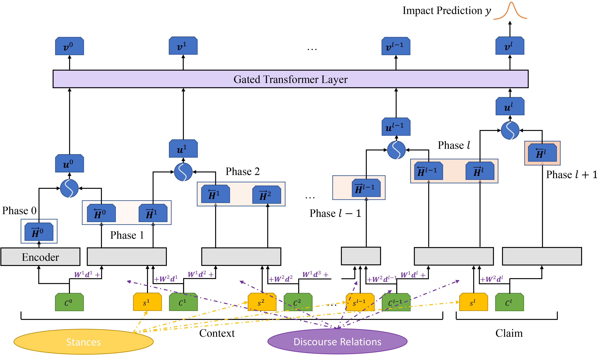

# DisCOC

This repository provides the DisCOC model, which is used in the argument impact classification.

*Figure 1: Architecture*



## Data and Pretrained Models

* We use a dataset crawled from *kialo.com* to evaluate our model. The dataset is provided by [Esin Durmus](https://www.cs.cornell.edu/~esindurmus/), and you can contact her via email ([esdurmus@stanford.edu](mailto:esdurmus@stanford.edu)). If you get the data, please put `argument_impact.pkl` in `data/arg_impact` and put `argument_specificity_stance.pkl` in `arg_spec_stance`.
* We use the pretrained BMGF-RoBERTa to predict the implicit discourse relations between two arguments. Please refer [BMGF-RoBERTa](https://github.com/HKUST-KnowComp/BMGF-RoBERTa/) to get the code and pretrained model. Alternatively, you can use the predictions in `data/arg_impact` directly.

## Results

| Model | Precision | Recall | F1  |
| ----- | --------- | ------ | --- |
| HAN-BiLSTM | 51.93 | 49.08 | 50.00 |
| HAN-BERT | 53.72 | 53.45 | 53.46 |
| HAN-RoBERTa | 55.71 | 55.95 | 55.49 |
| HAN-XLNet | 53.91 | 55.56 | 54.53 |
| BERT (Durmus et al., 2019) | 57.19 | 55.77 | 55.98 |
| Flat-BERT | 57.34 | 57.07 | 56.75 |
| Flat-RoBERTa | 58.11 | 56.40 | 56.69 |
| Flat-XLNet | 55.86 | 56.20 | 55.57 |
| Interval-BERT | 55.56 | 55.52 | 55.34 |
| Interval-RoBERTa | 58.31 | 56.46 | 56.61 |
| Interval-XLNet | 57.54 | 56.78 | 56.52 |
| Context-BERT | 54.96 | 56.09 | 55.44 |
| Context-RoBERTa | 57.28 | 55.29 | 55.83 |
| Context-XLNet | 54.56 | 56.28 | 55.10 |
| Memory-BERT | 54.33 | 57.57 | 55.22 |
| Memory-RoBERTa | 55.08 | 55.55 | 54.76 |
| Memory-XLNet | 55.44 | 55.45 | 54.91 |
| **DisCOC** | **57.90** | **59.41** | **58.36** |

*Table 1: Performance of DisCOC and baselines with different attention mechanisms.*


*Figure 2: F1 scores of different models on varying the maximum path length.*

Please refer to [Exploring Discourse Structures for Argument Impact Classification
](https://arxiv.org/abs/2106.00976) to see another results.

## Pipeline

### Package Dependencies

* spacy
* torch
* tensorboardX
* sentencepiece
* transformers
* numpy
* pandas
* tqdm
* scikit-learn

### Preprocessing

We need to merge the stance and discourse relations with text features.
Please refer to `src/preprocess_argimpact.ipynb` to preprocess data and check correlations. 

### Model Training 

#### Classifiers based on text, stances, and discourse relations

To train models with text features with stances and discourse relations, you need to run `train_chain.py`.
You can use different encoders (e.g., lstm, bert, roberta, xlnet, and albert) and different encoding modes (e.g., han, flat, interval, segmented, contextualized, and discoc).
Another hyper-parameters can also be passed by command line arguments.

```bash
python train_chain.py \
    --train_dataset_path ../data/arg_impact/train.jsonl \
    --valid_dataset_path ../data/arg_impact/valid.jsonl \
    --test_dataset_path ../data/arg_impact/test.jsonl \
    --save_model_dir ../dumps/argimpact \
    --label_map argument_impact_label_map_3 \
    --max_len 100 \
    --max_num_text 1 \
    --max_num_context 5 \
    --mode discoc \
    --encoder roberta \
    --gpu_ids 0,1 \
    --epochs 10 \
    --train_batch_size 32 \
    --eval_batch_size 10 \
    --lr 2e-5 \
    --weight_decay 0.0 \
    --max_grad_norm 2.0 \
    --activation leaky_relu \
    --dropout 0.1 \
    --finetune full \
    --add_trans \
    --save_best f1 \
    --seed 0
```

#### Predictors based on discourse relations

We also provide the script to predict the argument persuasion only by discourse relations. You can run `train_disco.py` to reproduce the experiments.

```bash
python train_disco.py \
    --train_dataset_path ../data/arg_impact/train_discourse.jsonl \
    --valid_dataset_path ../data/arg_impact/valid_discourse.jsonl \
    --test_dataset_path ../data/arg_impact/test_discourse.jsonl \
    --save_model_dir ../dumps/argimpact \
    --label_map argument_impact_label_map_3 \
    --max_num_pairs 5 \
    --predictor lstm \
    --hidden_dim 128 \
    --gpu_ids 0 \
    --epochs 100 \
    --train_batch_size 32 \
    --eval_batch_size 10 \
    --lr 1e-3 \
    --weight_decay 5e-4 \
    --max_grad_norm 2.0 \
    --activation leaky_relu \
    --dropout 0.0 \
    --save_best f1 \
    --seed 0
```

## Reference
The details of this architecture are described in the following paper. If you use this model in your work, please kindly cite it.

```bibtex
@inproceedings{LiuOSJ21,
  author    = {Xin Liu and
               Jiefu Ou and
               Yangqiu Song and
               Xin Jiang},
  title     = {Exploring Discourse Structures for Argument Impact Classification},
  booktitle = {Annual Meeting of the Association for Computational Linguistics and the International Joint Conference on Natural Language Processing (ACL-IJCNLP) 2021},
  year      = {2021},
}
```
